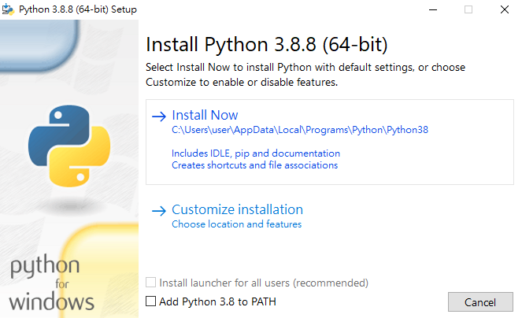

# 說明書
## 步驟一
### 下載python
https://www.python.org/downloads/
### 下載git
https://git-scm.com/downloads
### 下載Chrome
https://www.google.com/intl/zh-TW/chrome/?brand=FKPE&gclid=CjwKCAjw6fCCBhBNEiwAem5SO1H__36dYPSUqPo5RWYWyQe4eM_PMXI1QJGSmtA5y3zBnz3I1vgBLBoCGWwQAvD_BwE&gclsrc=aw.ds
## 步驟二

### 安裝python
記得勾選Add Python to Path
### 安裝git
### 安裝chrome
## 步驟三
### 開啟命令提示字元(cmd)
### 輸入命令
git clone https://github.com/Andy-CH-BO-AN/auto-clock-in.git

## 步驟四
### 進入剛下載的資料夾
### 在資料夾的路徑輸入cmd，按Enter
### 開啟命令提示字元(cmd)

### 輸入命令
pip install -r requirements.txt
### 待安裝完畢
## 步驟五
### 進入該資料夾
### 編輯config.json，可以選擇記事本編輯，輸入自己的帳密。

### 在資料夾的路徑輸入cmd

### 輸入測試命令
python main.py 2
### 確認是否有正確執行，成功即可進入下一步驟，失敗可以扣github星星QAQ
## 步驟六
### 更改bat檔

### 對clockin.bat點擊右鍵，選擇編輯

### 複製專案資料夾路徑

### 至cd後面貼上，按ctrl + s(儲存檔案)
### 成功後可以點擊bat檔測試是否可成功打卡
### 對clockout.bat重複做一次步驟六
## 步驟七
### 建立排程
### 按windows鍵
### 在 Windows系統管理工具 中有一個 工作排程器

### 點開後在右邊的 動作 有一個建立工作

### 輸入名稱

### 點擊觸發程序

### 點擊新增並且設定上班或下班排程

### 確定後點擊動作

### 點擊新增並且設定動作

### 點擊瀏覽，若是設定上班排程選擇clockin.bat
### 下班排程選擇clockout.bat

### 選擇確定後再選擇確定

### 點擊左上角的工作排程程式庫

### 可以看到排程已經設定

### 也可以點擊右鍵手動執行

### 記得電腦要保持開機
### 請特休的時候調整一下排程，祝龍體安康。
